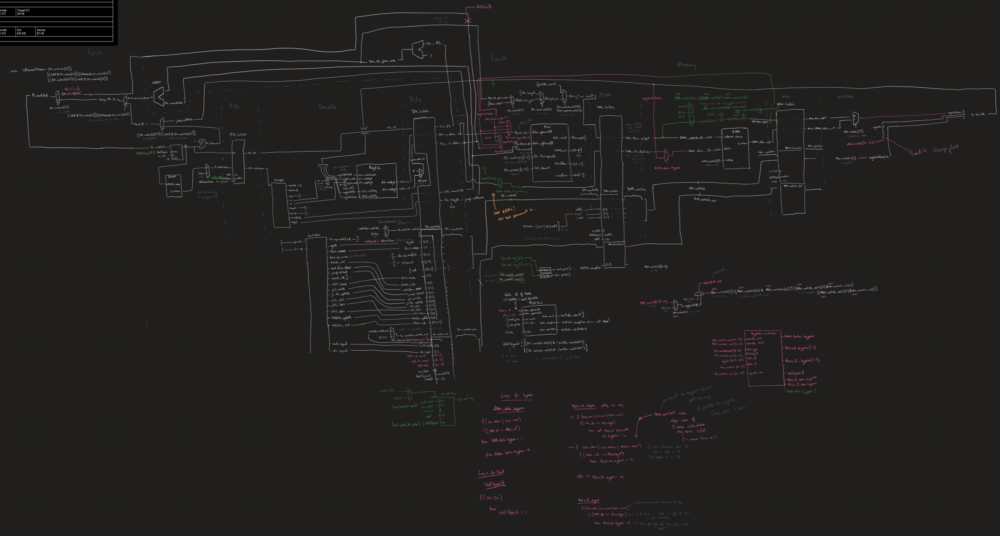

# Processor
## Shaan (ay140)

## Description of Design

This is a processor - my diagram that includes its logical structure is shown below.

## Bypassing
Bypassing is done to the RAM, ALUinA and ALUinB. This is done to prevent stalling and to allow for the processor to run faster.

## Stalling
Stalling is done to the RAM, ALUinA and ALUinB. This is done to prevent data hazards and to allow for the processor to run correctly.

## Optimizations
I made the processor run faster by bypassing and stalling.

## Bugs
No known bugs.